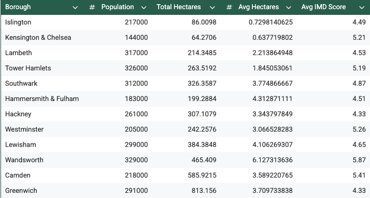
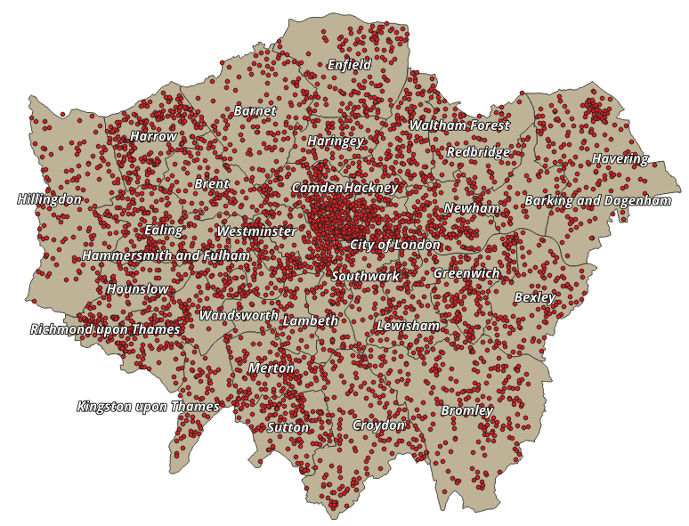
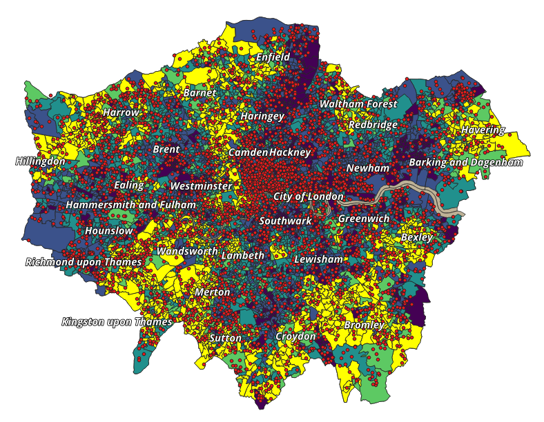
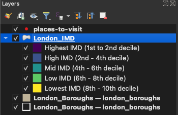
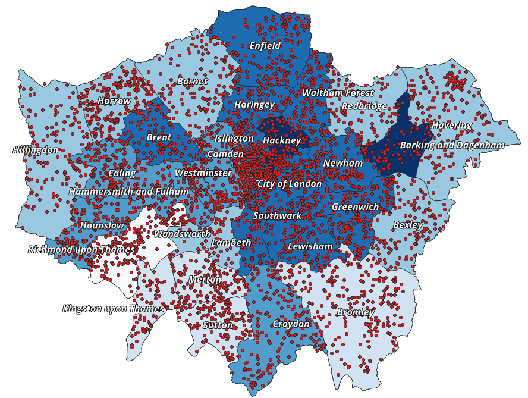
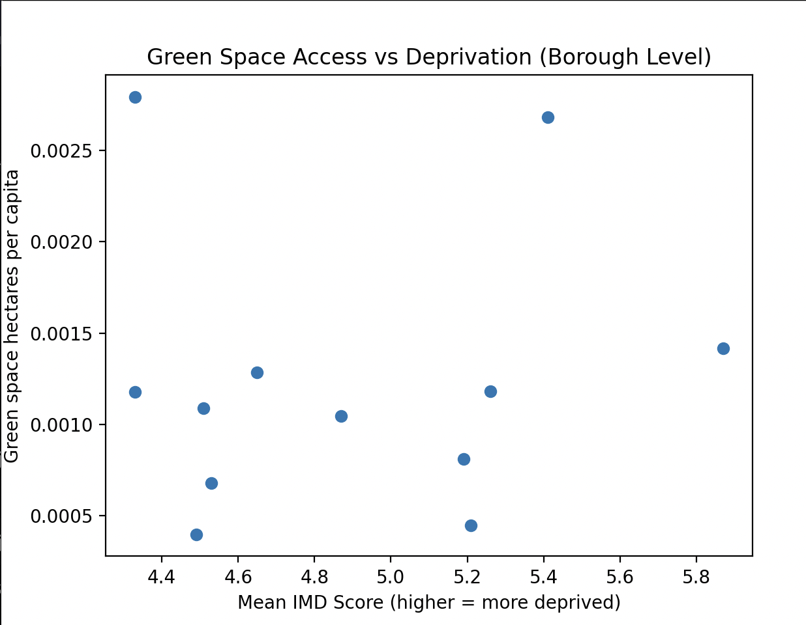

## **London Public Space Access vs Social Deprivation Spatial Analysis**

## **Project Goals**

In this project I wanted to explore how access to green and public spaces varies across London in relation to levels of socio-economic deprivation.

Specifically, this project sought to:

* Combine spatial data on green/public spaces with socio-economic deprivation data  
* Visualise patterns across London boroughs  
* Produce an interactive map that allows users to explore deprivation levels alongside nearby green spaces

## **Tools used**

* **Google Sheets** (data preparation)  
* **qGIS** (spatial analysis and visualisation)

**Data Sets Used & Key Terms**

### **Green & Public Spaces Dataset**

I used the SpacesToVisit dataset from [Greenspace Information for Greater London CIC \- GIGL](https://www.gigl.org.uk/)

This contains information on publicly accessible green spaces across London, including:

* Site name  
* Primary use (e.g. park, open square, playground)  
* Borough  
* Area (in hectares)  
* Access (e.g. free/ restricted)

#### **Index of Multiple Deprivation (IMD)**

The Index of Multiple Deprivation (IMD) is a UK government overall relative measure of deprivation. It is constructed by combining seven domains of deprivation according to their respective weights (detailed below).

For this, I sourced IMD 2019 data from the [Ministry of Housing, Communities and Local Government Geo Portal](https://communitiesopendata-communities.hub.arcgis.com/datasets/45e05901e0a14cca9ab180975e2e8194_0/explore?location=51.558610%2C-0.184025%2C11)

#### **English Indices of Deprivation 2019 (IoD2019)**

The Indices of Deprivation 2019 provide a set of relative measures of deprivation for small areas (Lower-layer Super Output Areas) across England, based on the following domains, the weights assigned to them were used to produce the IMD.

1. **Income (22.5%)**  
2. **Employment Deprivation (22.5%)**  
3. **Education, Skills and Training Deprivation (13.5%)**  
4. **Health Deprivation and Disability (13.5%)**  
5. **Crime (9.3%)**  
6. **Barriers to Housing and Services (9.3%)**  
7. **Living Environment Deprivation (9.3%)**

IMD scores are calculated at a small geographic level and can be aggregated to larger areas (such as boroughs) for analysis and comparison.

#### **LSOA (Lower-layer Super Output Area)**

Lower-layer Super Output Areas (LSOAs) are small geographic areas used in UK statistics. They typically contain around 1,500 residents and are designed to be relatively consistent in population size.

IMD scores are originally calculated at the LSOA level.

### **London boroughs**

London boroughs are larger administrative areas. For this project, I aggregated LSOA-level IMD scores to the borough level to allow clearer visual comparison across London.

**Figure 1:** Table with cleaned LSOA data converted to borough level.

**Methodology**

1. Relevant datasets were sourced and cleaned using Google Sheets.  
2. Green space data was reviewed and filtered to retain publicly accessible locations.  
3. Datasets were imported into qGIS.  
4. Spatial joins were performed to align green space locations with borough boundaries.  
5. A choropleth map was created to show average IMD scores.  
6. Green spaces were overlaid as point markers with clickable pop-ups displaying attribute information.

##
**Figure 2:** This is a lower level map showing London boroughs and public space markers. Each red point is a park or public space. 

**Figure 3:** Hovering over a point will create a pop-out like this one with some key info about that space.

**Figure 4:** Map showing average IMD scores colour coded for each LSOA. Darker shades indicate higher deprivation.

**Figure 5:** IMD colour key for LSOA-level map.

**Figure 6:** Map of IMD scores at the borough-level. Darker shades of blue indicate higher deprivation.

## The Big Question

#### **Is there an association between socio-economic deprivation (IMD) and access to green/public space at the borough level?**

- *as deprivation increases, does green space access increase or decrease?*

**Descriptive statistics:**

|  | Mean | Median | Range |
| :---- | :---- | :---- | :---- |
| IMD Score | 4.89 | 4.76 | 1.54 |
| Hectares per capita | 0.00125 | 0.00113 | 0.00240 |
| Sites per capita | 0.000456 | 0.000404 | 0.000639 |

**Correlation Analysis**

**Assumptions:**

* **Consistent (monotonic) but not necessarily linear relationship:**  
  * Green space access may generally increase or decrease with deprivation, but not in a strictly linear way.  
* **Presence of outliers:**  
  * London boroughs vary substantially in size, population density, and green space provision.  
* **Small sample size:**  
  * The analysis is based on a limited number of observations (London boroughs), making non-parametric methods more appropriate  
* **Ordinal interpretability:**  
  * The relative ranking of boroughs is more meaningful than precise numeric differences.

Following these assumptions, I have chosen to use **Spearman’s rank correlation** as it is resistant to outliers, does not assume linear relationships or normal distributions, and is appropriate for exploratory analysis of small-area socio-economic data as it focuses on relative relationships rather than exact measures of cause and effect between parameters.

#### **Spearman’s Rank Correlation**

Why I chose it for this analysis:

* It **doesn’t** care about exact values  
* It **does** care about **order (rank)**

How Spearman’s works:

* Take variable A (e.g. Avg IMD score) and rank it from lowest → highest  
* Take variable B (e.g. green space hectares per capita) and rank it from lowest → highest  
* Compare the two rankings

If:

* High ranks in A usually line up with high ranks in B → **positive correlation**  
* High ranks in A line up with low ranks in B → **negative correlation**  
* No consistent pattern → **near zero**

**Figure 7:** Python code used to calculate Spearman’s correlation:  

This gave me the following values for rho and p:   
**ρ \= 0.16, p \= 0.609**

What these mean:

A ρ of 0.16 represents a weak positive association, meaning that boroughs with higher deprivation **very slightly** tend to have more green space (by hectare) per capita.

The p-value answers the question: “How surprising would it be if there was no correlation between IMD scores and hectares of green space?”

A p-value of 0.609 indicates that there is no statistical evidence of a monotonic relationship between deprivation and green space access at borough level.

Although a weak positive correlation was observed (ρ \= 0.16), the result was not statistically significant (p \= 0.609), indicating no evidence of a meaningful relationship.

**Figure 8:** Scatter chart of correlation between average IMD scores at the borough-level against hectares of green space per capita:  

The scatter chart shows that there is not a clear or significant relationship between average deprivation scores and the amount of green space in a borough.

I also tested the relationship between deprivation and the distinct number of public spaces. This gave me the following values for my Spearman’s Correlation:   
**ρ \= 0.01, p \= 0.966**

**Figure 9:** Scatter chart of number of distinct green spaces against average IMD scores at the borough-level:  

This again affirms a very weak positive relationship with almost no statistical significance whatsoever (the typical boundary would be 0.05).

## **Conclusion:**

At borough level, deprivation does not appear to be associated with either the quantity of green space available per resident or the number of distinct green spaces. 

In boroughs with higher indices of multiple deprivation (IMD), there is no meaningful correlation to either the number of public spaces or to the hectares of publicly accessible green space.

**Problem Solving & Lessons Learned**

As this project was my first time ever using qGIS (or any spatial analysis tool for that matter), it taught me a lot and involved many challenges. 

Some issues that I had to resolve were:

* **Learning a new tool:** At the beginning, I had never even seen qGIS and first opening it and seeing all the tools and interfaces was quite overwhelming\! Understanding how this software handles vector layers, shapefiles, and coordinate reference systems was a necessary first step before analysis could begin.

* **Data preparation for GIS:** While I was comfortable enough joining up and cleaning my initial data sets in Google Sheets, understanding what qGIS needs to create shapefiles (geometry, coordinate system, field types) was all new to me. I had to muddle through a lot of error messages before I had a map that looked roughly how I wanted it to.

* **Aggregating IMD by borough rather than LSOA:** The raw IMD data was built around LSOA’s and this dataset did not include borough names. To solve this I used a spatial join to assign each LSOA to its containing borough. This then allowed me to calculate mean IMD scores per borough using “Join attributes by location (summary)” to create a borough-level polygon layer for my visualisation.

* **Pop-ups for green spaces:** I wanted to have pop-ups for each public space on the map that showed some key info when you hovered over them. I managed to get this working but they were cramped and hard to read in dark mode. By writing some custom HTML I was able to make them clearer and more readable.

**What I know now after completing this project:**

* Understanding GIS data structures, shapefiles, and coordinate reference systems.  
* How to combine multiple spatial datasets.  
* How to aggregate LSOA-level data to a higher administrative level.  
* How to improve map readability through styling, pop-ups, and clear legends.   
* How to plan a spatial analysis workflow and iterate to solve unexpected issues.
